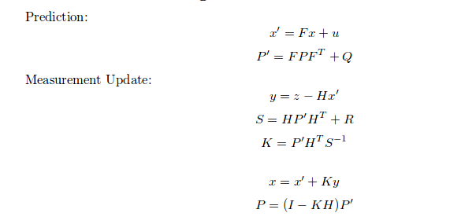
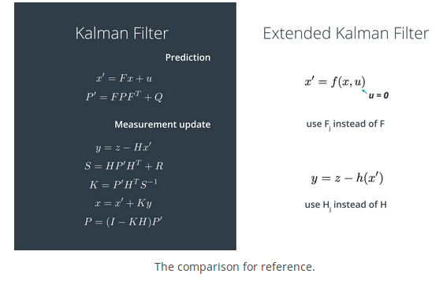

# Extended Kalman Filter Project

### Description of the project
* This project is used to apply extended kalman filter to track vehicles' movements based on its radar and lidar's information. 
* utilize self-driving cars' simulator to test impelmented kalman filter algorithms to confirm the correctness of the algorithms. 

### Here is Final result of the project:


### what is kalman fileter in the self-driving car:


* first measurement - the filter will receive initial measurements of the bicycle's position relative to the car. These measurements will come from a radar or lidar sensor.
* initialize state and covariance matrices - the filter will initialize the bicycle's position based on the first measurement.
* then the car will receive another sensor measurement after a time period Δt.
* predict - the algorithm will predict where the bicycle will be after time Δt. One basic way to predict the bicycle location after Δt is to assume the bicycle's velocity is constant; thus the bicycle will have moved velocity * Δt. In the extended Kalman filter lesson, we will assume the velocity is constant; in the unscented Kalman filter lesson, we will introduce a more complex motion model.
* update - the filter compares the "predicted" location with what the sensor measurement says. The predicted location and the measured location are combined to give an updated location. The Kalman filter will put more weight on either the predicted location or the measured location depending on the uncertainty of each value.
* then the car will receive another sensor measurement after a time period Δt. The algorithm then does another predict and update step.

### The algorithm for kalman filtering is the following:


### The Extended algorithms are used to handle non-linear Radar transformation:


### How to test my C++ impelmentation:
* Download [Simulator](https://github.com/udacity/self-driving-car-sim/releases/)
* Secondly, type the following commands in the terminal:
```
mkdir build && cd build
cmake .. && make
./ExtendedKF
```
* Open simulator to see my algorithms' performance

### Environment setting and software installation

* cmake >= 3.5
 * All OSes: [click here for installation instructions](https://cmake.org/install/)
* make >= 4.1
  * Linux: make is installed by default on most Linux distros
  * Mac: [install Xcode command line tools to get make](https://developer.apple.com/xcode/features/)
  * Windows: [Click here for installation instructions](http://gnuwin32.sourceforge.net/packages/make.htm)
* gcc/g++ >= 5.4
  * Linux: gcc / g++ is installed by default on most Linux distros
  * Mac: same deal as make - [install Xcode command line tools]((https://developer.apple.com/xcode/features/)
  * Windows: recommend using [MinGW](http://www.mingw.org/)

### Basic Build Instructions

1. Clone this repo.
2. Make a build directory: `mkdir build && cd build`
3. Compile: `cmake .. && make` 
   * On windows, you may need to run: `cmake .. -G "Unix Makefiles" && make`
4. Run it: `./ExtendedKF path/to/input.txt path/to/output.txt`. You can find
   some sample inputs in 'data/'.
    - eg. `./ExtendedKF ../data/obj_pose-laser-radar-synthetic-input.txt`

